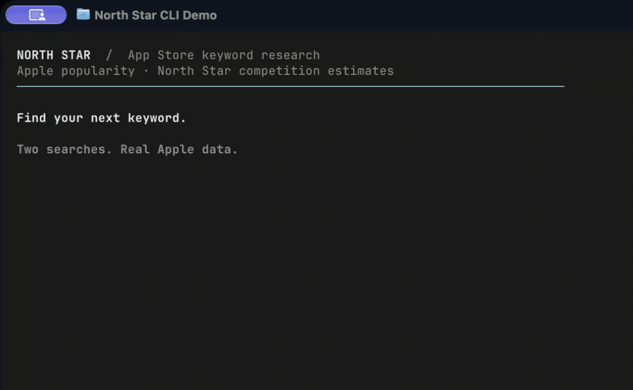

<p align="center">
  
</p>

# North Star

An App Store keyword research CLI and TypeScript library. Check keywords by country and store, see competing apps, and compare search popularity with a transparent competition estimate.

[](assets/north-star-ghostty-demo.mp4)

- **Popularity:** Apple's relative 1–100 index, when the exact keyword is reported. Requires your own Apple Ads API credentials.
- **Competition:** North Star's 1–100 estimate based on public app search results. Works without credentials.
- **JSON output:** Full results or compact summaries for scripts and AI agents.

Supports iPhone, iPad, and Mac storefront searches. Apple Ads popularity is available for supported iPhone/iPad markets; Mac popularity is unsupported.

## Quick start

Requires **Node.js 22.18 or later** and npm.

```sh
git clone https://github.com/eilonkr/north-star.git
cd north-star
npm ci
npm run --silent inspect -- "habit tracker" --summary
```

This works without an account: search results and competition are returned, while popularity is marked `not_configured`.

To install the `northstar` command from the checkout:

```sh
npm install -g .
northstar "habit tracker" --summary
```

Alternatively, run `node scripts/inspect.mjs` from the checkout. No website or server is required.

## CLI usage

```sh
northstar "plant identifier" --country US --range month --summary
northstar "habit tracker" "mood journal" --country GB --summary
northstar "notes" --country DE --store mac
northstar --countries
northstar --connection
northstar --help
```

Quote multi-word keywords. The command prints a JSON array, with one result per keyword in input order. Full results include up to 30 apps, popularity status and reporting period, and the competition score and its contributing factors. `--summary` keeps the scores, status, period, related reported terms, and first five apps.

| Option | Description |
| --- | --- |
| `-c, --country` | Storefront country code; default `US`. Use `--countries` for supported codes. |
| `-s, --store` | `iphone` (default), `ipad`, or `mac`. |
| `-r, --range` | `week` (default), `previous_week`, `month`, or `previous_month`. |
| `--summary` | Compact JSON output. |
| `--config` | Path to an Apple Ads credential file. |
| `--connection` | Check Apple Ads authentication and account access. |
| `--countries` | List supported storefront codes. |
| `-h, --help` | Show usage. |

Usage errors exit with code 1. Keyword lookups can return partial results with error fields and exit 0, so scripts should inspect `popularity.status` and `searchError` (or `popularityStatus` in summary output). `--connection` exits 0 only when connected.

## Enable popularity

Follow the [Apple Ads setup guide](docs/APPLE_ADS_SETUP.md) to register your own API key. App Store Connect keys are not interchangeable with Apple Ads credentials.

```sh
northstar --config /path/to/credentials.env --connection
northstar "habit tracker" --config /path/to/credentials.env --range month --summary
```

Credential-file selection: `--config`, then `NORTH_STAR_ENV_FILE`, then the checkout's `.env` if present, otherwise `~/.config/north-star/.env`. Existing environment variables take precedence over file values. Credentials remain local to the CLI or your server; never put them in browser code or commit them.

## Understand the results

**Missing popularity means unknown, not zero.** Apple's reporting dataset does not cover every keyword. `not_reported` means the exact term was absent for the selected country and period. Related terms have their own scores and are never substituted for the requested keyword. Popularity is a relative index, not monthly search volume.

Reporting ranges select one published weekly or calendar-month bucket, not a rolling average. Competition always uses the current search sample regardless of the popularity period. Search samples can be cached for 15 minutes and popularity for an hour within the same process.

**Competition is an uncalibrated estimate, not an Apple score or a probability of ranking.** It uses the first 10 apps in Apple's public Search API response, which is not guaranteed to match on-device App Store rankings:

| Factor | Weight | Signal |
| --- | --- | --- |
| Rating volume | 55% | Log-scaled rating count, capped at one million. |
| Title relevance | 30% | Exact phrase or query-token overlap. |
| Rating strength | 10% | Star rating discounted for small rating counts. |
| Update recency | 5% | Exponential decay with a 180-day time constant. |

Positions are weighted by `1 / log2(position + 1)`, then the combined value is mapped to 1–100. Fewer than three results yields no score; confidence is never higher than `limited`. The complete calculation is in [lib/scoring.ts](lib/scoring.ts).

Keep batches small. Apple [documents an approximate 20-request-per-minute limit](https://developer.apple.com/library/archive/documentation/AudioVideo/Conceptual/iTuneSearchAPI/Searching.html); sequential execution alone does not enforce it. North Star does not create campaigns, change bids, or spend money.

## Use with AI agents

Install the usage skill with the [skills CLI](https://github.com/vercel-labs/skills):

```sh
npx skills add eilonkr/north-star --skill northstar-keywords
```

Add `--global` for a user-wide installation. The skill provides instructions; install the CLI separately as shown above.

## TypeScript API

The package is named `@eilonkr/north-star-core`. From a checkout, run `npm pack` to build an installable archive, then install that archive in your project with `npm install /path/to/archive.tgz`.

```ts
import { inspect, inspectionInput } from '@eilonkr/north-star-core';

const input = inspectionInput.parse({
  keyword: 'habit tracker',
  country: 'US',
  store: 'iphone',
  reportingRange: 'month',
});

const result = await inspect(process.env, input);
```

The main entrypoint is server-only. Browser-safe market lists, reporting helpers, and search recovery are available from `@eilonkr/north-star-core/browser`. Applications own their HTTP endpoints and secret configuration.

## Development

```sh
npm ci
npm test
npm run typecheck
npm run build
npm pack --dry-run
```

See [AGENTS.md](AGENTS.md) for the repository layout, conventions, and contribution checks. Tests use mocked provider responses and generated test keys; no Apple credentials are needed.

## License

[MIT](LICENSE).
